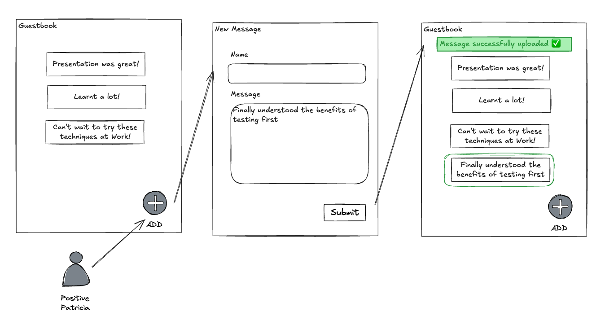

# Lab 0 - Guestbook walk through

Walk through layers of the existing Guestbook app - run the specs!



**Checkout tag**

```sh
git checkout lab-00-start
```

## Top Layer - Feature spec

```sh
bin/rspec spec/features/user_adds_message_to_guestbook_spec.rb

    # run feature spec slowed down
    SLOMO_MS=100 bin/rspec spec/features/user_adds_message_to_guestbook_spec.rb
    # run feature spec with debugger pauses
    SPEC_PAUSE=1 bin/rspec spec/features/user_adds_message_to_guestbook_spec.rb
```

## Middle Layer - Integration spec

```sh
# Integration spec (request spec)
bin/rspec spec/requests/messages_spec.rb
```

## Bottom Layer - Unit spec

```sh
# Unit spec (model spec)
bin/rspec spec/models/message_spec.rb
```
