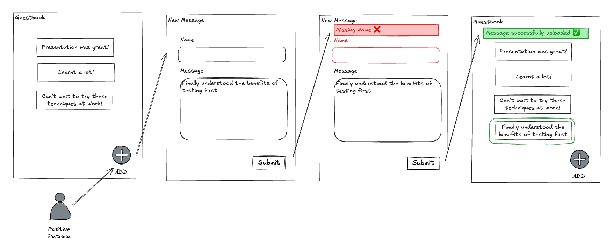

# Lab 1 - Mandatory body and name in message

Current guest book allows blank messages to be added 😲 ! **New requirement
✨**, make `message` and `name` mandatory and validate that they are not empty.



**Checkout tag**

```sh
# if you have any changes, stash them now
git stash

git checkout lab-01-start
```

## STEP 1: Start with a failing feature spec

```sh
# Search: LAB 01.1
#   spec/features/user_adds_message_to_guestbook_spec.rb:38
# follow instructions and you should see a pending test
bin/rspec spec/features/user_adds_message_to_guestbook_spec.rb
```

## STEP 2: Failing integration spec

```sh
# Search: LAB 01.2
#   spec/requests/messages_spec.rb:27
# follow instructions and you should see 3 failing tests
```

## STEP 3: Failing model spec

```sh
# Search: LAB 01.3
#   spec/models/message_spec.rb:20
# follow instructions and you should see failing tests
```

## STEP 4: Implement the change

```sh
# Search: LAB 01.4
#   app/models/message.rb:14
# follow instructions and you should see passing model tests
```

## STEP 5: Verify all layers of tests are now passing

```sh
# run Model tests
bin/rspec spec/model/message_spec.rb
# run Integration tests
bin/rspec spec/requests/messages_spec.rb

# can now remove the pending
# run Feature tests
bin/rspec spec/features/user_adds_message_to_guestbook_spec.rb
```

## STEP 6: Feature complete 🎉

- describe the change in the feature test
- 3 layers of failing tests: feature, integration, unit
- implement the change
- all tests pass and the feature can be shipped 🚢

## Helpful Code Points

```sh
# intermediate step with code commented out
git checkout lab-01-commented

# final code with the feature complete
git checkout lab-01-complete
```
