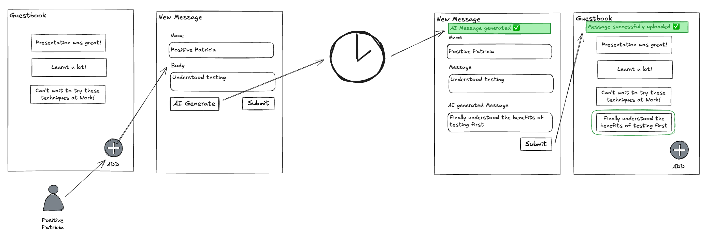

# Lab 2 - Text Generation

Current guest book allows low-quality messages 😭 ! **New requirement ✨**, allow
a user to have improved text generated based on the original message they type
in.



**Checkout tag**

```sh
# if you have any changes, stash them now
git stash

git checkout lab-02-start
```

## STEP 1: Start with a failing feature spec

```sh
# Search: LAB 02.1
#   spec/features/user_adds_message_to_guestbook_spec.rb:94
# follow instructions and you should see a pending test due to the missing generate AI button.
bin/rspec spec/features/user_adds_message_to_guestbook_spec.rb
```

## STEP 2: Implement the generate AI button

```sh
# Search: LAB 02.2
#   app/views/messages/show.html.erb:20
# make the generate AI button visible and running the specs should fail for a different reason.
```

## STEP 3: Update the generated message with the generated text

```sh
# Search: LAB 02.3
#   app/controllers/generated_messages_controller.rb:12
# make the generate AI button visible and running the specs should fail for a different reason.
```

## STEP 4: Update the notification message

```sh
# Search: LAB 02.4
#   app/controllers/generated_messages_controller.rb:25
# once the update and notification message are updated, the spec should pass.
bin/rspec spec/features/user_adds_message_to_guestbook_spec.rb
```

## STEP 5: Fix update method

```sh
# Search: LAB 02.5
#   app/controllers/generated_messages_controller.rb:44
# Have a play in the browser and make sure that update allows a user to update the generated message
make dev # to run dev server
```

## STEP 6: Feature complete 🎉

- describe the new scenario in the feature test
- implement a new controller to add generated text
- ship it 🚢

## Helpful Code Points

```sh
# intermediate step with code commented out
git checkout lab-02-commented

# final code with the feature complete
git checkout lab-02-complete
```
