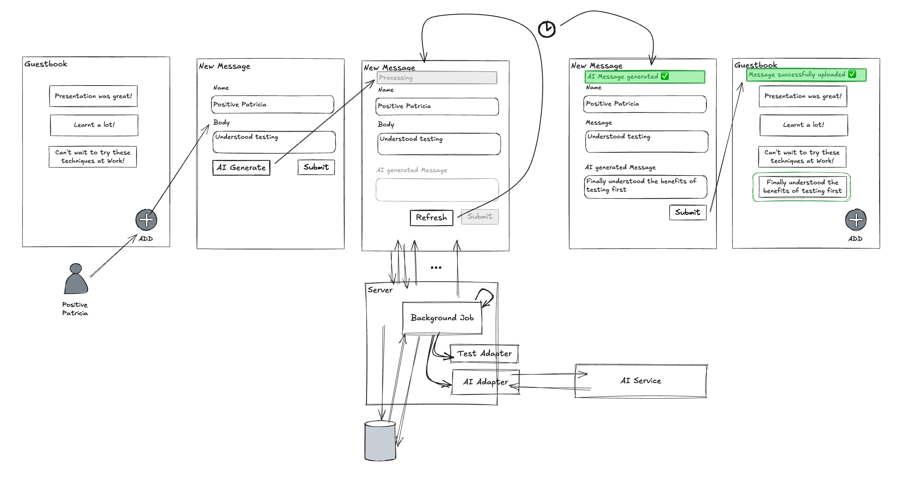

# Lab 4 - Text Generation in background job

AI takes some time to process the text and the user is left wandering when the
request will finish 😢 ! **New requirement ✨**, return immediately, tell the
user AI is doing it's job and allow the user to check if it has complete.



**Checkout tag**

```sh
# if you have any changes, stash them now
git stash

git checkout lab-04-start
```

## STEP 1: Start with a failing feature spec

```sh
# Search: LAB 04.1
#   spec/features/user_adds_message_to_guestbook_spec.rb:115
# write out the new part of the user flow to get immediate feedback and
# manually poll to see if the text has been generated.
bin/rspec spec/features/user_adds_message_to_guestbook_spec.rb --example AI

# error should be something like
# could not find notification "AI text is being generated."
```

## STEP 2: Change the create method to call a background job

```sh
# Search: LAB 04.2
#   app/controllers/generated_messages_controller.rb:58
bin/rspec spec/features/user_adds_message_to_guestbook_spec.rb --example AI
```

## STEP 3: Change the notification for job being created

```sh
# Search: LAB 04.3
#   app/controllers/generated_messages_controller.rb:81
bin/rspec spec/features/user_adds_message_to_guestbook_spec.rb --example AI

# error should be something like
# could not find notification "AI text is being generated."
# BUT after the refresh on line 141
```

## STEP 4: Change the update method to allow refresh

```sh
# Search: LAB 04.4
#   app/controllers/generated_messages_controller.rb:81
```

## STEP 5: Run the feature spec to see if it passes

```sh
bin/rspec spec/features/user_adds_message_to_guestbook_spec.rb
```

## STEP 6: Feature complete 🎉

- describe the change in user flow in the feature test
- use a background job in the controller
- ship it 🚢

## Helpful Code Points

```sh
# intermediate step with code commented out
git checkout lab-04-commented

# final code with the feature complete
git checkout lab-04-complete
```
