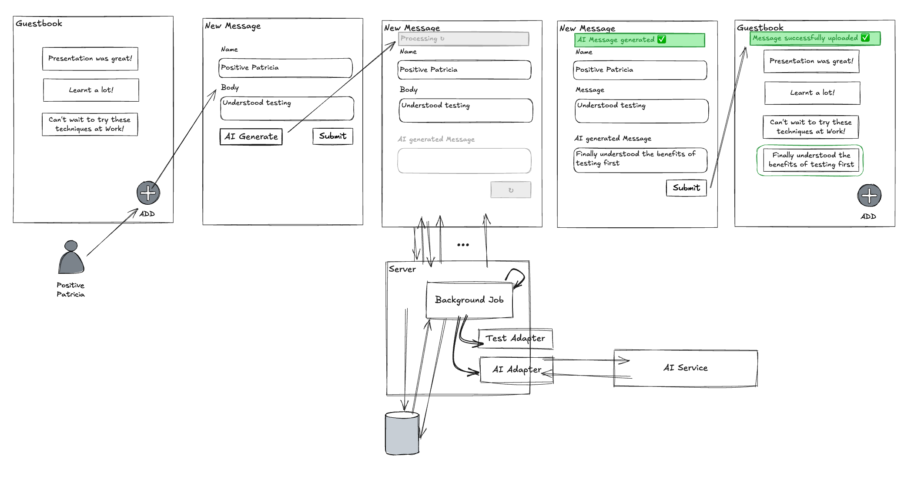

# Lab 5 - Dynamic async loading UI

Leaving it up to the user to reload the page is idiotic 🤪 ! **New requirement
✨**, improve the UI (_User Interface_) by using a dynamic component to
asynchronously notify the user the AI text is ready.



**Checkout tag**

```sh
# if you have any changes, stash them now
git stash

git checkout lab-05-start
```

## STEP 1: Start with a failing feature spec

```sh
# modify the user feature flow to not require a manual refres
bin/rspec spec/features/user_adds_message_to_guestbook_spec.rb
```

## STEP 2: Implement a dynamic solution

```sh
# use react or javascript or turbo or similar to display a spinner and poll
# a bunch of examples can be found in
#   - http://localhost:3000/demo
# or in code
#   - `app/views/demos/show.html.erb`
```

## STEP 3: Continue till complete

```sh
# modify the user feature flow to not require a manual refres
bin/rspec spec/features/user_adds_message_to_guestbook_spec.rb
```

## STEP 5: Feature complete 🎉

- implementation is left as an exercise for the user
- ship it 🚢
