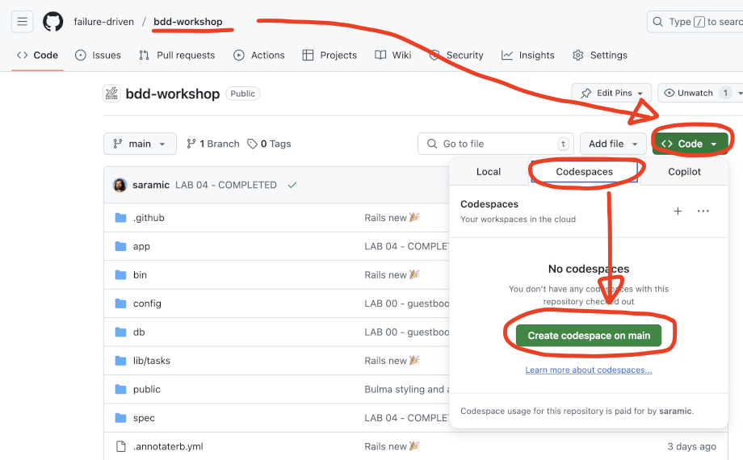

# README

## Welcome to BDD workshop!

Start by setting up your dev environment from

https://github.com/failure-driven/bdd-workshop


### Setup Option 1: Code spaces (easy)

_Use Code Spaces for a seamless experience._



- `code` -> `codespaces` -> **`Create codespace on main`**

```sh
make

# ⚠️ Important ⚠️ manually use correct version of rvm ruby
rvm install $(cat .ruby-version) && rvm use .

make build                  # runs tests

make setup                  # sets up DB and runs dev server

make dev                    # run dev server
                            # codespaces will open up a tab to view in the browser window
```

---

<p align="center">
  <strong>OR</strong>
</p>

---

### Setup Option 2: Local development (advanced)

_Note: we will not troubleshoot this option._

```sh
git clone git@github.com:failure-driven/bdd-workshop.git
cd bdd-workshop

make
make build                  # runs tests

make setup                  # sets up DB and runs dev server

make dev                    # run dev server
open http://localhost:3000  # have a go in the browser
```

---

## Labs

1. [Lab_00.md - Guestbook walk through](./LAB_00.md)
1. [Lab_01.md - Mandatory body and name in message](./LAB_01.md)
1. [Lab_02.md - Text Generation](./LAB_02.md)
1. [Lab_03.md - AI Text Generation](./LAB_03.md)
1. [Lab_04.md - Text Generation in background job](./LAB_04.md)
1. [Lab_05.md - Dynamic async loading UI](./LAB_05.md)

---

**END**
